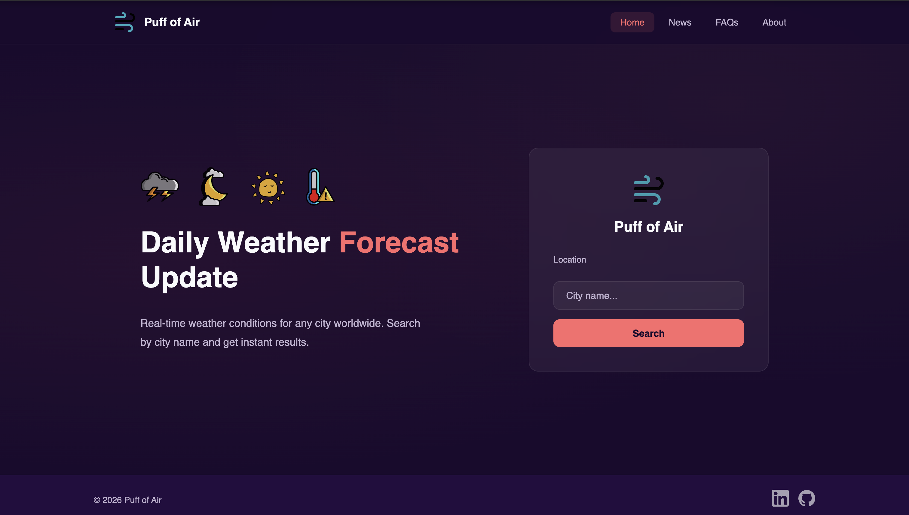
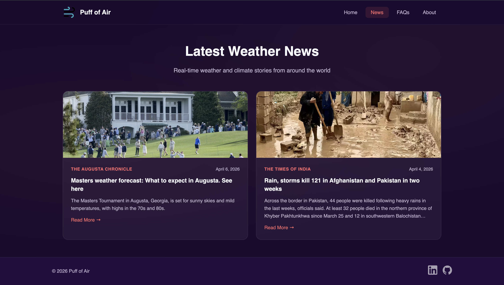

# 🌬️ Puff of Air

A server-rendered weather web app that delivers real-time weather conditions for any city worldwide — built with Node.js, Express, and EJS.

---

## 📸 Preview

### Home



### Weather Results


### News



---

## ✨ Features

- 🔍 Search current weather by city name
- 🌡️ Displays temperature, feels like, humidity, wind speed, pressure
- 🌅 Sunrise and sunset times adjusted to local timezone
- 🗺️ Coordinates (latitude and longitude)
- 🖼️ Dynamic background images based on weather condition
- 📰 Live weather news from NewsAPI
- ❓ FAQ accordion
- 👤 About page with tech stack
- 🛡️ Security headers via Helmet.js
- ⚡ Rate limiting to prevent abuse
- 📋 Request logging

---

## 🛠️ Tech Stack

| Layer         | Technology                                   |
| ------------- | -------------------------------------------- |
| Runtime       | Node.js                                      |
| Framework     | Express.js                                   |
| Templating    | EJS + express-ejs-layouts                    |
| Weather API   | OpenWeatherMap (Geocoding + Current Weather) |
| News API      | NewsAPI                                      |
| Security      | Helmet.js                                    |
| Rate Limiting | express-rate-limit                           |
| Styling       | Custom CSS — no frameworks                   |

---

## 🌐 APIs Used

- **OpenWeatherMap** — real-time weather data and geocoding (city name → coordinates)
- **NewsAPI** — latest weather and climate news articles

---

## 🧠 Key Concepts

- Server-side rendering with EJS layouts and partials
- Two-step geocoding — city name converted to coordinates before weather fetch
- REST API integration with native `fetch` (Node.js 18+)
- Layered architecture — config, middleware, services, and routes fully separated
- Error handling middleware with custom status codes
- Environment-based configuration via `.env`
- Input encoding to handle special characters in city names
- Content Security Policy via Helmet.js

---

## 📁 Project Structure

```
puff-of-air/
├── public/
│   ├── css/          # Page-specific stylesheets
│   ├── icons/        # SVG icons
│   ├── images/       # Weather background images
│   └── js/           # Client-side scripts
├── src/
│   ├── config/       # App configuration and environment variables
│   ├── middleware/   # Request logger and error handler
│   ├── routes/       # Express route handlers
│   └── services/     # OpenWeatherMap and NewsAPI integrations
├── views/
│   ├── layouts/      # Main EJS layout
│   ├── partials/     # Header and footer
│   └── *.ejs         # Page templates
├── .env              # Environment variables (not committed)
├── .gitignore
├── index.js          # App entry point
└── package.json
```

---

## ⚙️ Getting Started

### Prerequisites

- Node.js v18+
- API key from [OpenWeatherMap](https://openweathermap.org/api)
- API key from [NewsAPI](https://newsapi.org)

### Installation

```bash
# Clone the repository
git clone https://github.com/Alzubi-Omar/puff-of-air.git
cd puff-of-air

# Install dependencies
npm install
```

### Environment Variables

Create a `.env` file in the root of the project:

```env
API_KEY=your_openweathermap_api_key
NEWS_API_KEY=your_newsapi_key
PORT=3000
```

> ⚠️ Never commit your `.env` file. It is listed in `.gitignore`.

### Run the App

```bash
# Development
npm run dev

# Production
npm start
```

Then open your browser at `http://localhost:3000`

---

## 🔐 Security

- **Helmet.js** — sets secure HTTP headers and Content Security Policy
- **Rate limiting** — limits each IP to 100 requests per 15 minutes
- **Input encoding** — city search input is encoded before API calls
- **Environment variables** — all API keys stored in `.env`, never hardcoded

---

## 📌 Roadmap

- [ ] Unit toggle (°F / °C)
- [ ] 5-day weather forecast
- [ ] Geolocation support
- [ ] Weather data visualization

---

## 👤 Author

**Omar Alzubi**

- LinkedIn: [omaralzubi-007oa](https://www.linkedin.com/in/omaralzubi-007oa/)
- GitHub: [Alzubi-Omar](https://github.com/Alzubi-Omar)
- Portfolio: [omar-alzubi-portfolio.netlify.app](https://omar-alzubi-portfolio.netlify.app)
- Email: omaralzubi.dev@gmail.com

---

## 📄 License

This project is licensed under the MIT License.
